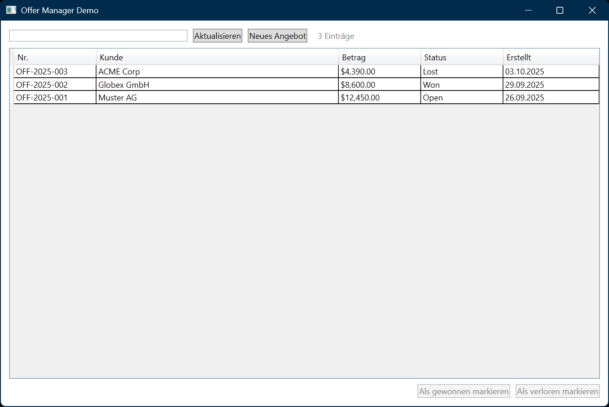

# OfferManagerDemoApp

Lauffähiges **WPF .NET 8**-Beispielprojekt mit **MVVM** und einfacher **DI**.
- Mock-Datenquelle (in-memory)
- Suche, Hinzufügen, Status ändern
- Reine Open-Source-Abhängigkeiten (NuGet Restore erforderlich)

## Build
dotnet build .\src\OfferManagerDemoApp\OfferManagerDemoApp.csproj
dotnet run --project .\src\OfferManagerDemoApp\OfferManagerDemoApp.csproj

Oder in Visual Studio: `OfferManagerDemoApp.csproj` öffnen und starten.

## Struktur
- `Models/Offer.cs`
- `Services/IOfferService.cs`, `MockOfferService.cs`
- `ViewModels/OffersViewModel.cs`
- `Views/MainWindow.xaml` (+ Code-behind)
- `App.xaml`, `App.xaml.cs`

## Ziele & Architektur
- MVVM: ViewModel entkoppelt View, Bindings/Commands statt Code-Behind
- DI: Microsoft.Extensions.DependencyInjection für Service-Wiring (Mock austauschbar)
- Testbarkeit: IOfferService erlaubt einfache Unit-Tests ohne UI

## How to run

Dieses Projekt wurde mit .NET 8 und WPF entwickelt.  
Zum Starten genügt:

```
cd src/OfferManagerDemoApp
dotnet build
dotnet run
```

## Preview



## Known limitations
- **Mock-Daten**, keine Persistenz (keine DB/REST). Fokus ist UI/MVVM.
- **Fehlerbehandlung/Validierung** minimal gehalten.
- **Tests**: keine Unit-Tests enthalten (bewusst reduziert für Demo).
- **Internationalisierung**: keine Lokalisierung vorgesehen.

## Contributing
1. Repo forken und lokal klonen.
2. Feature-Branch anlegen: `git switch -c feature/<kurz-beschreibung>`
3. Saubere Commits (präzise Messages, kleine Einheiten).
4. `dotnet build` (optional: `dotnet format` falls eingerichtet).
5. Pull Request erstellen – kurze Beschreibung, Screenshots willkommen.


